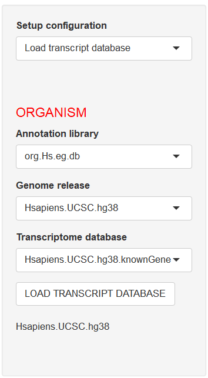
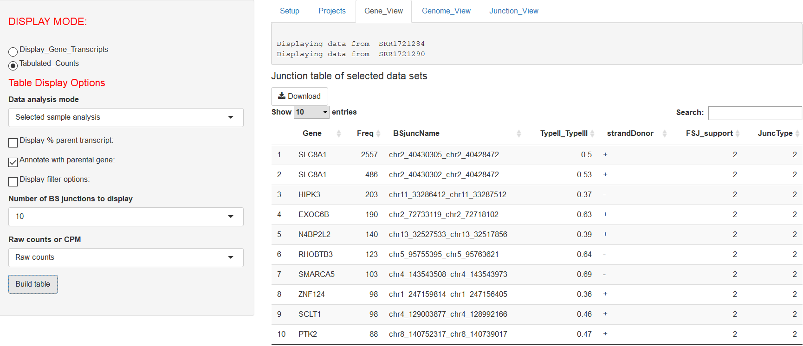
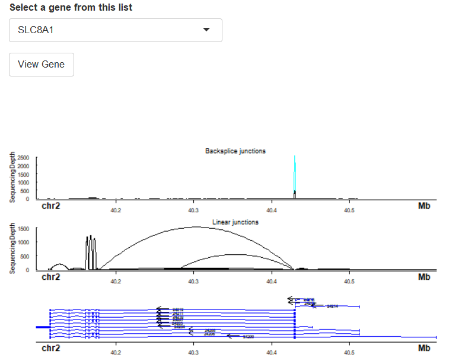
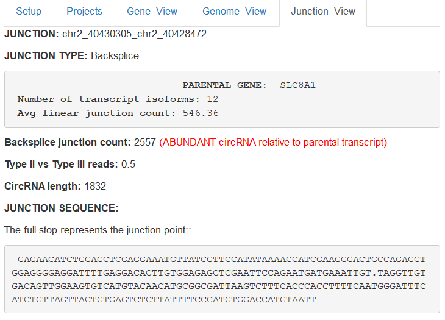
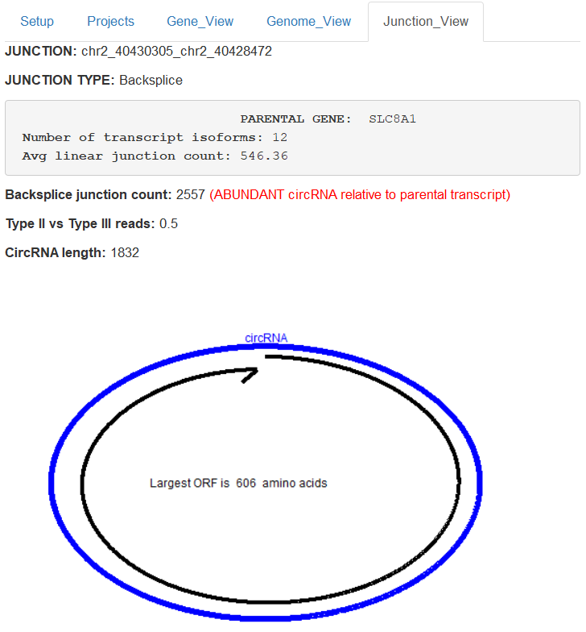
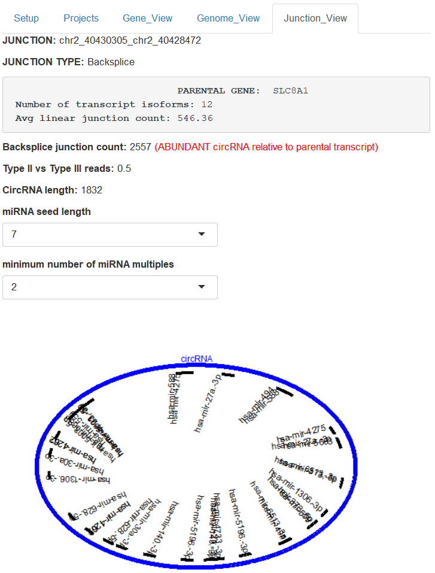

```{r setup,echo=FALSE}
library(knitr)
library(BiocStyle)
```


# Introduction

Splicing is the removal of intronic sequences from a nascent pre-mRNA transcript resulting in the formation of mature mRNA. There are numerous mechanisms of splicing and is a regulated process that typically involves multiple RNA-binding proteins. In Eukaryotes splicing can result in gene isoforms, poly-cistronic transcripts, gene fusions and circular RNA (circRNA).

 The complexities of splicing  can be captured by RNA-Sequencing. Ularcirc takes  canonical forward slice junction (FSJ) and backsplice junction (BSJ) outputs generated from a variety of programs (STAR aligner, Regtools, circExplorer2, CIRI2) and provides a platform to integrate and analyse these datasets. Ularcirc provides visualisation and analysis tools for both forward canonical splice junctions (generated from mature mRNAs) and backsplice junctions (generated from circRNAs). Ularcirc dynamically generates visualisations, including the ability to a zoom to defined regions within a gene locus, and furthermore can extract the transcript sequence that spans specific exon junctions.
 
 In theory Ularcirc can be operated on computer setup that can run the R-programing language. All operations proceed in real time via a menu driven interactive analysis where data tables and visualization are generated dynamically. Ularcirc does not require significant computational resources and is currently implemented to operate on one CPU thread. The saved project data sets are small (typically in the low MB range) which enables easy sharing of data files. Introductory tutorials on how to use Ularcirc can be found on youtube. 
 
Ularcirc is comprised of numerous interactive screens that comprise of a main and side panel. The main panel allows the selection of one of four tabs which are titled ``Setup``, ``Project``, ``Gene_View``, ``Genome_View``, ``Junction_View``. A different side panel exists for each main panel and display  specific options that help direct and assemble analysis. The main panel will display output relevant for each stage of circRNA analysis which this vignette describes in detail. Users should be aware that some analysis may take time to complete and floating status bars will notify of the progress.
\end{abstract}

# Quickstart

The following demonstrates how to download Ularcirc, install the required databases, and then visualise canonical and backsplice junctions counts of the gene Slc8a1.  


STEP1: Install Ularcirc package

```
library(BiocInstaller) 
# use source("http://www.bioconductor.org/biocLite.R") if not available
biocLite("Ularcirc")
```

STEP2: Load annotation databases: Ularcirc comes with one existing data set that has been aligned to hg38. While annotation is not required to identify circRNAs we recomment to download the respective human annotation databases as follows:

```
library(BiocInstaller) 
# use source("http://www.bioconductor.org/biocLite.R") if not available
biocLite("BSgenome.Hsapiens.UCSC.hg38")         # Genome; enables sequence analysis
biocLite("TxDb.Hsapiens.UCSC.hg38.knownGene")   # Transcript database
biocLite("org.Hs.eg.db")                        # Annotation database
```

STEP3: Start Ularcirc, load annotation database, load project data  
```
library(Ularcirc)
Ularcirc()
```

If the annotation + transcript + genome databases have been loaded ``LOAD TRANSCRIPT DATABASE`` they should automatically populate on the left panel (as shown in figure \@ref(fig:HG38AvailableDatabases). Press ``LOAD TRANSCRIPT DATABASE`` and below this button will appear the text ``Hsapiens.UCSC.hg38``.

```{r HG38AvailableDatabases, out.width='65%', fig.cap = 'Screenshot of Ularcirc available annotations',echo=FALSE}

```


The preloaded data set is called TwoSzabo which is loaded via the Project tab. Upon loading a popup window will appear displaying Associated meta data (for your reference). Click any where outside this window to close it.  Two data files should now appear under ``Selected Sample`` and ``Grouped analysis`` headings on main tab. 

STEP4: 

Navigate to ``Gene_View`` tab. In the options on the left hand panel select ``Annotate with parental gene`` as shown in figure \@ref(fig:AnnotatingTwoSzabo). Select ``build table`` and thereafter Ularcirc will build a table of annotated backspice junction counts. 

```{r AnnotatingTwoSzabo, out.width='100%', fig.cap = 'Screenshot of Ularcirc Gene view tab.',echo=FALSE}

```


Select the first entry in the table (it will highlight in blue). Next select ``Display_Gene_Transcripts`` from the left side tab which will dynamically generate a visualisation of Slc8a1 with both backsplice and canonical forward splice junctions (as shown in \@ref(fig:SLC8a1TwoSzabo)

```{r SLC8A1TwoSzabo, out.width='100%', fig.cap = 'Screenshot of Slc8a1 back splice  and canonical splice junctions.',echo=FALSE}

```


# Preparing input data sets

## Splice junction files
Ularcirc requires canonical and chimeric splice junction output files generated from the STAR aligner which  MUST contain the default file extensions of SJ.out.tab and Chimeric.out.junction respectively. For detailed instructions on how to use the STAR aligner please visit url https: github alexdobin STAR . Note that the STAR aligner requires significant computational resources. There are publically available GALAXY resources to run STAR if you do not have access to other high performance computational resources https://usegalaxy.org}).
To generate the required chimeric junction files the following two parameters must be supplied to the STAR aligner. The numeric value provided to each parameter describes features used to detect chimeric reads and therefore may need to be altered to improve sensitivity and accuracy.

```
--chimSegmentMin 15  --chimJunctionOverhangMin 15
```

Ularcirc can only add files to individual projects via one upload. Attempting to upload multiple times will only result in previous upload being overwritten by the current upload. Individual or multiple samples are identified by a common file prefix. Therefore for a given project all splice junction files must be located in a common directory and have the appropriate file prefix. For example if the following files were uploaded into Ularcirc:

```
SRR12345678_e17.5_heart.Chimeric.out.junction
SRR12345678_e17.5_heart.SJ.out.tab
SRR87654321_P10_heart.Chimeric.out.junction
SRR87654321_P10_heart.SJ.out.tab
```


The above example would result in two samples IDs being imported into Ularcirc, SRR123456768_e17.5_heart and SRR87654321_P10_heart. It is highly recommended to provide a descriptive name as Ularcirc provides no functionality at this time to rename samples. After files are uploaded the Project filename can be entered and saved. The STAR aligner can be instructed to assign a common prefix to output files. This can be specified with the following option:

```
--outFileNamePrefix Type_your_prefix_here
```

## Annotation databases

Ularcirc can annotate backsplice and canonical splice junctions via integrating bioconductor databases. Three installations are required per organism, examples of the required datasets for the most recent human and mouse is shown below.


| Database type | Database name for hg38            |
|---------------|-----------------------------------|
| BSGenome      | BSgenome.Hsapiens.UCSC.hg38       |
| TxDb          | TxDb.Hsapiens.UCSC.hg38.knownGene |
| OrgDatabase   | org.Hs.eg.db                      |


| Database type | Database names for mm10           |
|---------------| ----------------------------------|
| BSGenome      | BSgenome.Mmusculus.UCSC.mm10      |
| TxDb          | TxDb.Mmusculus.UCSC.mm10.knownGene|
| OrgDatabase   | org.Mm.eg.db                      |


# Workflow

Ularcirc is designed to follow a logical systematic workflow which is broken down into five key steps. Each step is can be performed  via a tabs that can be selected via the main panel as shown in figure \ref{MainPanelTabs.PNG}. The workflow commences on the left most tab (setup) which is  the initial screen displayed. The setup tab also  provides a quickstart guide that briely describes the workflow. This chapter provides a more in depth overview of each of these steps and users are encouraged to familiarise themselves with the contents of this chapter to make the most out of Ularcirc.

\incfig{MainPanelTabs.PNG}{}{Screen shot of the five tabs that can be selected within Ularcirc} 

## Step 1a: Loading annotation data

Upon startup Ularcirc loads and displays contents on the ``setup`` tab within the main panel. The side panel can be configured to one of three options which is selected via the pulldown menu under ``Step configuration``. The default configuration  is Load transcript database which enables the selection of organism, genome and transcriptome databases via separate pulldown menus under the heading ``ORGANISM``. If three pulldown menus are not populated this indicates that databases have not been installed from bioconductor.

## Step 1b: Setting filters
### Genomic filters
Ularcirc provides both genomic filtering options and circRNA filtering options. Genomic filtering provides options to limit chimeric (BSJ) detection  to defined genomic distances/locations. The default limits are designed to capture the majority of mammalian circRNAs. However these limits can be relaxed which will increase the number of chimeric candidates and potentially false positives. Below is a description of the genomic filters:


|  Filter         |       Description                                            |
|-----------------|--------------------------------------------------------------|
|Same chromosomes | Selecting this checkbox will only select chimeric reads that span a common chromosome. |
| Chimeric genomic distance |  This is the maximum and minimum chimeric distance considered for chimeric junctions that are identified on the same chromosome. The default settings will not detect and chimeric junction that spans less than 200nt or longer than 100000nt. |
| Same strand   | Will only select chimeric junctions that are from the same strand. |
 
### circRNA filters
Two circRNA filters are designed to discriminate between FALSE and TRUE positives. The first filter is the read alignment distribution (RAD) score which is the ratio of type II and type III alignments. It can only be calculated for paired end sequencing data and should  only be applied to BSJ that have a reasonable depth (eg > 9). 

The second filter is called ``FSJ support`` which identifies if each of the BSJ coordinates are also utilised in FSJ. Given that there are two coordinates that define a BSJ the corresponding FSJ support metric can have a value of 0, 1 or 2. A FSJ support score can be calculated for all BSJ irrespective of read count. 

Ularcirc provides functionality to filter BSJ against pre-defined values for both the RAD and FSJ support metrics. The default thresholds can be modified under the gene tab after selecting DisplayFilterOptions checkbox (see image below)

\incfig{DisplayFilterOptions.PNG}{}{Screen grab of the Display filter options which can be on side bar under gene view tab} 


## Step 1c: Loading new data sets
Ularcirc uses a number of output files generated by the STAR aligner which include the canonical splice junction (SJ.out.tab), chimeric junctions (Chimeric.out.junction) and gene counts (ReadsPerGene.tab.out). For full functionality all three files should be loaded per sample. However Ularcirc will still provide functionality if only one of the splice junction files are loaded.
It is very important that the  junction files have the default file extension as provided by the STAR aligner (see below). To upload files users must navigate to the Setup tab and then select Load new data under the pull down menu Setup option configuration. Prior to file upload a number of genomic filtering configuration options are available. The default filters require that chimeric alignments exist on the same strand of the same chromosome and that the chimera junction occurs over a distance less than 100,000 nucleotides.  There are currently no filters for canonical splice junctions and Ularcirc will display information on unique splice junction alignments as provided by the STAR aligner. Once filters are defined the user then selects the upload button and files are uploaded and alignments that don’t match filter settings are removed. If a malformated file is uploadd Ularcirc will notify you of its failure.

Multiple samples can be uploaded into Ularcirc but this can only be done in one upload event. Attempting to upload files separately will only result in previous upload being overwritten by the current upload. During a multi-file upload samples are identified by a common file prefix.  For example if the following files were uploaded into Ularcirc

```
SRR12345678_e17.5_heart.Chimeric.out.junction 
SRR12345678_e17.5_heart.SJ.out.tab
SRR12345678_e17.5_heart.ReadsPerGene.tab.out
SRR87654321_P10_heart.Chimeric.out.junction   
SRR87654321_P10_heart.SJ.out.tab
SRR87654321_P10_heart.ReadsPerGene.tab.out
```


The above example would result in two samples IDs being imported into Ularcirc, SRR123456768_e17.5_heart and SRR87654321_P10_heart. It is highly recommended to provide a descriptive project name when saving as Ularcirc provides no functionality at this time to rename samples.

After files are uploaded the Project filename can be entered and saved (refer Step2 Saving/loading a project).


## Step 2a: Saving/loading a project and grouping samples

New data sets or existing project data sets can be saved or loaded through the Projects tab. Data sets that are loaded through Ularcirc can be saved as a project file which can then be reloaded at a later date. Projects should be saved in a common folder/directory that exists on the local file system. This folder/directory is defined at the top of the  main page of the projects tab. This directory should NOT be set to the R Ularcirc library  directory as any future upgrades will overwrite pre-existing files. 

Different RNA-Seq library prep kits are capable of capturing the same or opposing strand of RNA. Some kits are do not capture the strand of a RNA transcript. The top most panel on the side bar provides the opportunity to record this information.

All saved projects that are present in the working directory will be listed in the pulldown menu located under the blue "Load" title on sidebar. Note that any new data sets that may have been loaded in the current Ularcirc session will not be visable until Ularcirc is restarted. To load selecting the project name and press load. Data is loaded when sample names are listed on the main tab.

To save a project a unique project name must be entered into the sidebar under entry "Name of project" and then pressing the save button. Ularcirc will not overwrite an existing project file and will warn users if the entered name is not unique.

## Step 2b: Grouping samples

After loading a project file or uploading new junction data the associated sample IDs will be listed with checkboxes in two locations on the main tab. These two listings are referred to as "Selected samples" and "Data groupings" and provide provide flexibility in the way downstream analysis can be performed.

The first listing which is under ``Selected Samples`` provides users the option to analyse a subset of specific data sets to analyse. This option is useful to explore circRNA expression patterns in individual data sets that are available within a project. Data sets that are selected in this list are the only samples that contribute to the integrated genomic visualisations under the Gene_View tab. Data sets delected in this listing can be be used to tabulate backsplice junction counts via the Gene_View tab by selecting the "Selected Samples". 

The second listing of sample IDs is provided under the heading``Grouped analysis`` data sets. Here users can assign samples to specific groups, which is useful for whole project analysis. The number of groups is defined in the sidebar, and can range between 1 and 10. After defining the number of groups individual samples can be assigned to a group via the main panel. Samples selected in this listing can be analysed via the name "Grouped analysis" under the Gene_View tab.


## Step 3a : Generating BSJ counts

The Gene_view tab is the location where results tables and visualisation of data take place. There are two display modes available ``Display gene transcripts`` and ``Tabulated counts`` which either can be selected on the side bar. The "tabulated counts" provides real time collation, annotation and analysis of back splice junctions. Data sets that were defined on the ``Projects`` tab are referred to as ``Grouped analysis`` or ``Selected sample`` under heading ``Data sets to analyse``.

Ularcirc provides a number of annotation options that are incorporated into tables. The first annotation option is ``Display % of parental transcripts``. This annotation is the most CPU intensive operation as Ularcirc calculates average forward splicing junctions (FSJ) across different gene features. This includes calculating average FSJ counts within the boundaries of a BSJ, average FSJ across the parental gene, and average FSJ counts outside the boundary of the BSJ.

The read alignment distrbution (RAD) annotation provides a scoring metric that helps assess if a BSJ is likely to be a false positive. This score can only be calculated from paired end reads and reflects the proportion of alignments that capture a BSJ derive from one of the read pairs. We define alignments that capture a BSJ in the primary read as Type II and BSJ detected in the paired read as Type III. A value of 0.5 reflects that BSJ were detected from equalt proportions of both Type II and Type III alignments. The default setting is to accept all BSJ that have a RAD score between 0.05 and 0.95 and this score is authomatically populated in all assembled tables. The ``Apply RAD filter`` check option provides a quick option to disable RAD score filtering of BSJs.  

Ularcirc will automatically annotate all entries with the gene names of overlapping parental genes. Ularcirc does not filter BSJ based on any parental gene filter such as exon boundaries. If a BSJ overlaps two genes both gene entries will be populated into the final table. BSJ that do not overlap a known gene are populated with ``unknown``. 

The generated tables provide provide functionality to select individual splice juntions (FSJ and BSJ). By selecting a table row will prime Ularcirc to display that gene entry and highlight the specific junction in colour. It also primes the junction to be analysed in the "Junction_View" tab.


## Step 3b : Visualising gene splicing patterns

Ularcirc dynamically generates insightful visualisation of forward splice junctions integrated with backsplice junctions. This feature is accessed via the "Display gene Transcripts" option located on the Gene_view tab. At the top of the main panel is a grey box that lists what samples were used to generate the image. The pulldown menu provides the ability to select gene names that of the defined transcript data base (which users selected on the setup tab). Users can select gene names by typing part of a gene name. When typing  be aware that gene names are dynamically loaded from the server and therefore if the gene name is typed too fast the gene will not be found.  Alternatively genes can be selected via selecting corresponding rows of the tables generated under Tabulated_Counts. 

Once a gene is selected visualisation of that gene commences when the ``View Gene`` button is selected. Ularcirc will dynamically prepare two loop graph and one gene model images.


## Exploring slicing patterns from any genomic region

The genome tab within Ularcirc provides explorative analysis within defined genomic regions. This is particularly useful to explore splice junctions that exist outside annotated transcript regions. Note that Ularcirc pre-fills in the chromosome entries from all identified entries listed within the slice junction files. Users cannot visualise chromosomes where there are no splice junctions. The start and end fields are to be entered manually. Finally users must select either the positive or negative strand. Remember the captured strand varies between RNA-Seq kits.

## Step 5: Sequence analysis of splice/backsplice junctions

To obtain detailed information on a particular junction (either forward splice or backsplice) the junction must be selected. Splice junctions can be selected after displaying either the ``Backsplice junction count data`` or ``Canonical junction count data``. Note that only one backsplice junction and one canonical splice junction can be selected at any one time. A number of features that relate to the selected splice and/or backsplice junction are populated in the ``Junction view`` tab. The sidebar menu of the junction view tab provides an option to display information on the selected backsplice or the canonical junction. The sequence of either a backsplice or canonical junction contains a ``.`` character in the position of the joining exon ends as shown below. Ularcirc can also predict the complete circRNA sequence which is a concatenation of the longest combinations of exons that reside within the boundaries of the backsplice junction. 

```{r HG38Slc8a1_BSJ, out.width='65%', fig.cap = 'Ularcirc Junction view tab showing a backsplice junction for Slc8a1. Note that the . character defines splice junction',echo=FALSE}

```

For backsplice junctions Ularcirc provides further sequence analysis in the form of open reading frame (ORF) and microRNA binding site analysis. Output of these analyses can be selected from the side bar tab. The ORF analysis displays the longest ORF as a graphic on the main tab (see figure below for an example). There are options that can display the amino acid sequence of this ORF on the side tab.

```{r HG38Slc8a1_ORF, out.width='65%', fig.cap = 'Ularcirc Junction view tab showing the potential ORF within Slc8a1',echo=FALSE}

```

For microRNA binding site analysis Ularcirc can analyse the predicted circRNA sequence. By default Ularcirc searches for complementary 7nt miRNA seed sequence that exist within the circRNA. There are options to increase or descrease the definition of the miRNA seed in a pull down menu. Ularcirc by default will only display miRNA bindings sites that are found at least two times. This threshold can also be modified via a pulldown menu as shown in the figure below. 

```{r HG38Slc8a1_miRNA, out.width='65%', fig.cap = 'Ularcirc Junction view tab showing potential miRNA binding sites that reside within Slc8a1',echo=FALSE}

```


# Session Information-----------------------------------

```{r sessionInfo}
sessionInfo()
```


